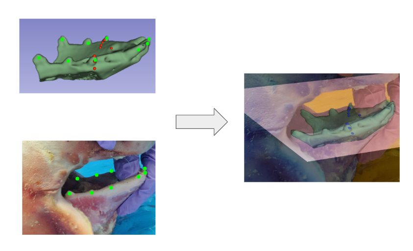
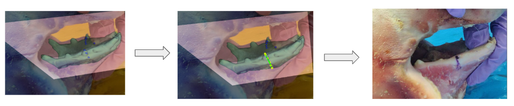
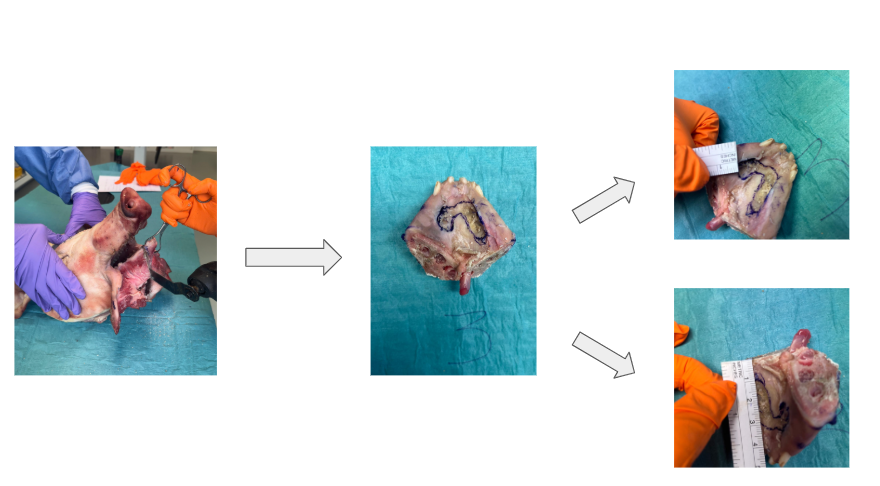

Computer Vision for Screen-rendered Augmented Reality for Mandibular Tumor Surgery

Data:

2D Ct Scan projections + Live Video feed

Pipeline:

Manual Landmark Selection on both inputs.
Correspondence established -> Registration via RANSAC
Homography was calculated and used to transform the CT Scan.
Transformed CT projected over video. 
CT contains an osteotomy path. Projected Osteotomy is used to draw a path on the static camera frame.
Osteotomy drawn on a static frame is used as a guide to draw the osteotomy path on the actual object.
The surgeon does validation of results and calcualtes the Target Registration Error.
Tracking via Optical Flow.

Semi-Automation via YOLOv8s.
Annotation via Label studio -> Ultralytics YOLOv8s model trained -> Detected landmarks used as points from the Camera frame. CT Landmarks manually selected.

 

 

 

