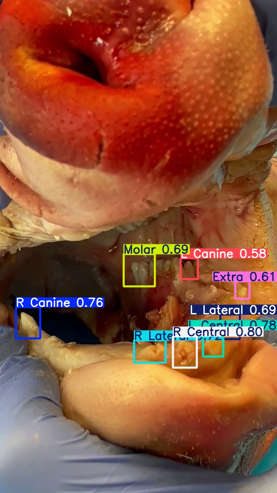
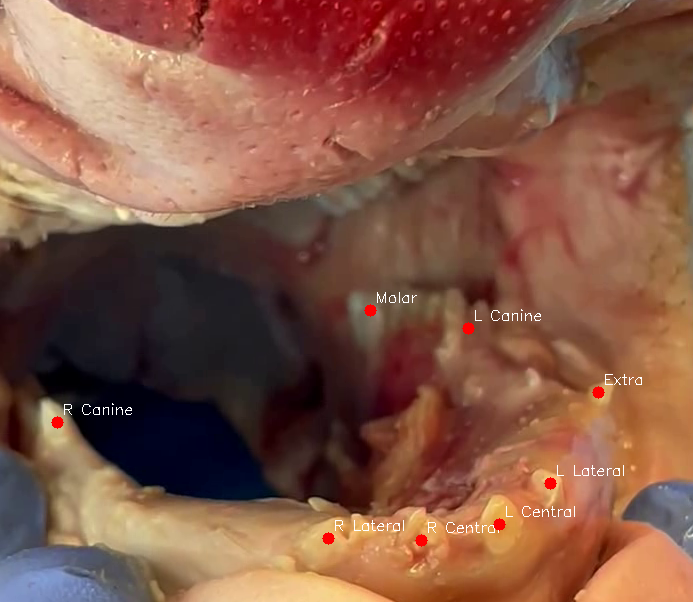

**Augmented Reality in Mandibular Tumor Surgery**

This project is my MSc in Artificial Intelligence in Health Internship Thesis. It was carried out at the Institut de Chimie Moléculaire de l'Université de Bourgogne - ICMUB UMR CNRS 6302 laboratory under the supervision of Dr. Caroline Guigou and Dr. Alain Lalande. The CT Scans used were obtained at CHU, Dijon, Hospital. The details of this project can be found in a detailed report attached under "MSc Thesis".

Computer Vision for Screen-rendered Augmented Reality for Mandibular Tumor Surgery

Data:

2D Ct Scan projections + Live Video feed

Pipeline:

Manual Landmark Selection on both inputs.
Correspondence established -> Registration via RANSAC
Homography was calculated and used to transform the CT Scan.
Transformed CT projected over video. 
CT contains an osteotomy path. Projected Osteotomy is used to draw a path on the static camera frame.
Osteotomy drawn on a static frame is used as a guide to draw the osteotomy path on the actual object.
The surgeon does validation of results and calculates the Target Registration Error.
Tracking via Optical Flow.

Semi-Automation via YOLOv8s.
Annotation via Label studio -> Ultralytics YOLOv8s model trained -> Detected landmarks used as points from the Camera frame. CT Landmarks manually selected.

*Manual Registration Pipeline*

 

 

 

*Semi-Automatic Landmark Selection via YOLO*

 

 

